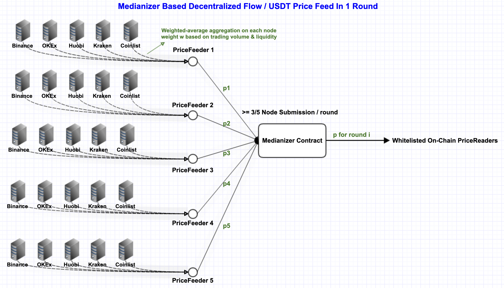

# Increment Oracle
There's currently no price oracle service living on Flow blockchain. We're building and maintaining a price oracle service that combines both decentralization and practicability. The service may also serve as public goods for other projects building on Flow blockchain.<br>
More Info: [docs](https://docs.increment.fi/protocols/decentralized-money-market)
<br>

## 🧩 Project Overview
<p>
    <a href="https://docs.increment.fi/protocols/decentralized-money-market">
        
    </a>
    <a href="https://docs.increment.fi/protocols/decentralized-money-market">
        
    </a>
</p>
<br>

## 📖 Directory Layout
```js
├── cadence
│   ├── contracts
│   │   ├── OracleConfig.cdc        /* common configurations, such as paths to prevent hardcoding */
│   │   ├── OracleInterface.cdc     /* interface descriptions of PriceReader and PriceFeeder */
│   │   └── PriceOracle.cdc         /* the oracle contract, responsible for calculating the median price */
│   └── transactions
│       ├── feeder                  /* PriceFeeder's usage example */
│       │   ├── mint_local_price_feeder.cdc
│       │   ├── publish_price.cdc
│       │   └── set_price_expire_duration.cdc
│       ├── oracle                  /* whitelist control */
│       │   └── ...
│       └── reader                  /* PriceReader's usage example */
│           ├── get_median_price.example.cdc
│           └── mint_local_price_reader.example.cdc
└── tools
    ├── data-visualization          /* monitoring visualization of prices */
    └── off-chain                   /* off-chain scripts for price offering */
```
<br>

## Current Price States
[Testnet States](https://testnet.increment.fi/oracle)
<br>

## 💹 Oracle deployed
### testnet
```
    Flow/USD: 0xcbdb5a7b89c3c844
    USDT/USD: 0x6d692450d591524c
    FUSD/USD: 0x3b220a3372190656
    USDC/USD: 0xc911d6ddfae70ce8
    BUSD/USD: 0xdad0aaa285a25413
    BLT/USD:  0x2d766f00eb1d0c37

    TEST/USD: 0x24650d6246d4176c  // for testing without whitelist
```
### mainnet
```
    Flow/USD: PENDING
    FUSD/USD: PENDING
    ...
```
<br>

## 🛠️ Deployment
### Emulator
1. Run `flow emulator -v` to start emulator
2. Run `python ./scripts/deployment/emulator/deploy.sh` to deploy accounts and contracts.
3. Run `python ./scripts/deployment/emulator/test.sh` for testing.
<br>

## 📤 To be a PriceReader
1. Apply for price reader permission and join the whitelist.
    * Please contact contact@increment.fi and provide: 
        + testnet or mainnet
        + the list of oracles want to apply for, e.g.  Flow/USD, USDT/USD
        + the address the contract which will use the price
        + project name and purpose to use the price

2. Mint the PriceReader resource by the specific oraclee contract and save it in local storage.
    * example: `cadence/transactions/reader/mint_local_price_reader.example.cdc`

3. Get the median price via the PriceReader resource.
    * example: `cadence/transactions/reader/get_median_price.example.cdc`

## 📥 To be a PriceFeeder
1. Each price requires a separate PriceFeeder resource and expose the specified public capability.
    * how to mint: `cadence/transactions/feeder/mint_local_price_feeder.cdc`
2. As a price provider, the oracle price must be published on time.
    * expire time can be set: `cadence/transactions/feeder/set_price_expire_duration.cdc`
    * price publish example: `cadence/transactions/feeder/publish_price.cdc`
3. In order to ensure the robustness of the oracle node, the PriceFeeder should be tested on testnet.
    * To apply for the testnet PriceFeeder whitelist, please contract contact@increment.fi.
